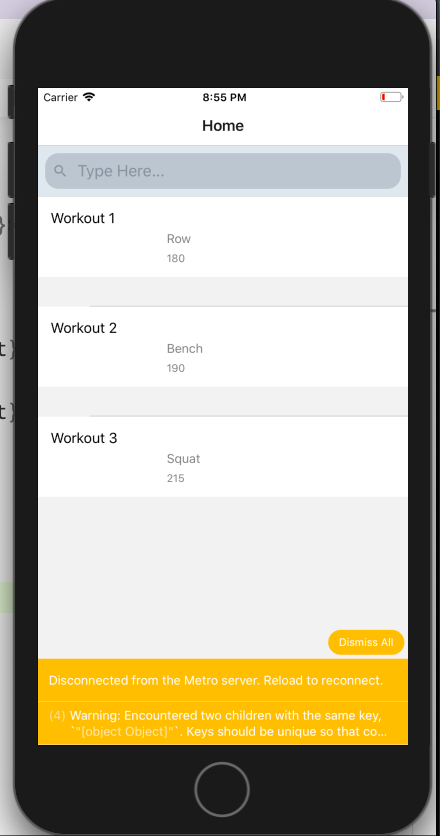
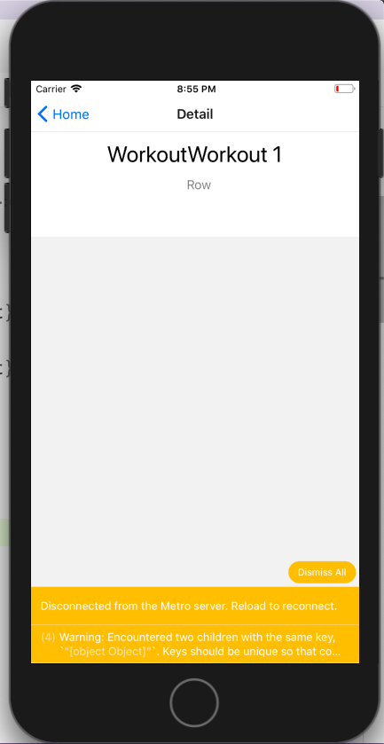

# Workout App
The goal of this project is to get experience connecting a React Native app to a REST API to provide essential application data.

## Progress #1
I accomplished my primary goal by creating a basic React Native app, fetching data in the mobile app from my previously built [Workout API](https://github.com/campbellmarianna/workout-backend).
| Home View | Detail View | 
| --- | --- |
|  |  |

## Progress #2
Since I accomplished my primary objectives I decided to engage more into the workout app concept.
